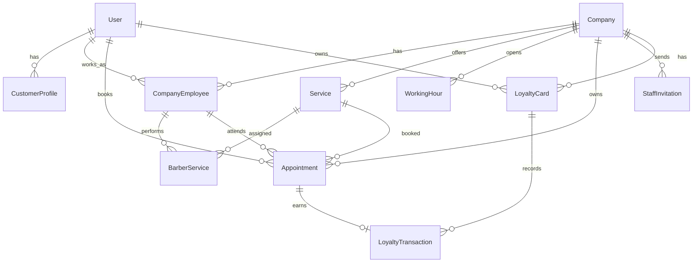

# Modelagem atual

## Entidades principais

## User

Usuario base do sistema. Pode atuar como owner, cliente e/ou barbeiro dependendo dos vinculos.

Campos publicos principais:

- `id`
- `email`
- `full_name`
- `phone`

## Company

Representa a barbearia/tenant.

Campos principais:

- `id`
- `name`
- `slug`
- `is_active`
- timestamps

## CompanyEmployee

Vinculo entre usuario e empresa.

Roles atuais:

- `OWNER`
- `BARBER`
- `CUSTOMER`

Na pratica atual:

- owner e criado no cadastro de empresa;
- barbeiro e criado ao aceitar convite;
- cliente usa `CustomerProfile`.

## Service

Servico oferecido por uma empresa.

Campos principais:

- `name`
- `description`
- `price`
- `duration_minutes`
- `is_active`

Validacoes:

- preco deve ser positivo;
- duracao deve ser maior que zero.

## BarberService

Vinculo entre barbeiro e servico.

Regras:

- funcionario deve ter role `BARBER`;
- servico e barbeiro devem pertencer a mesma empresa;
- somente vinculos ativos entram na disponibilidade.

## WorkingHour

Horario de funcionamento da empresa.

Regras:

- `start_time` deve ser menor que `end_time`;
- a fase atual nao suporta expediente cruzando meia-noite.

## Appointment

Agendamento de um cliente com barbeiro e servico.

Status atuais:

- `pending`
- `confirmed`
- `cancelled`
- `completed`
- `expired`

Status que ocupam agenda:

- `pending`
- `confirmed`

## StaffInvitation

Convite para usuario se tornar barbeiro.

Seguranca:

- token puro nao e salvo;
- banco salva apenas `token_digest`;
- convite expira;
- convite so pode ser aceito uma vez.

## LoyaltyCard

Cartao fidelidade de um cliente dentro de uma empresa.

Regras:

- o saldo e separado por empresa;
- cada par empresa + usuario possui no maximo um cartao;
- saldo nao deve ser alterado sem transacao correspondente.

## LoyaltyTransaction

Historico transacional de pontos.

Tipos atuais:

- `earn`
- `redeem`
- `adjustment`

Regras:

- agendamento concluido gera ponto somente uma vez;
- resgate exige saldo suficiente;
- transacoes nao devem ser deletadas;
- ajuste manual fica registrado no historico.
