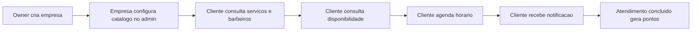
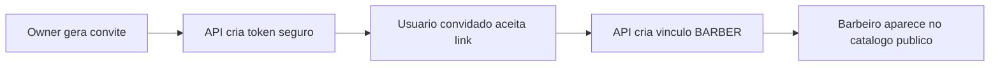

# Visao geral

A API foi desenhada como uma aplicacao Django REST Framework multiempresa. Cada barbearia e representada por uma `Company`, identificada publicamente por `company_slug`.

As rotas publicas usam o slug da empresa para isolar catalogo, barbeiros, horarios e disponibilidade. As rotas autenticadas usam JWT e restringem dados do usuario autenticado.

## Principios atuais

- Manter DRF como base da API.
- Separar regras de negocio em services/selectors quando o fluxo exige validacoes alem do serializer.
- Evitar vazamento entre empresas filtrando consultas por `company_slug`.
- Expor somente dados necessarios em rotas publicas.
- Nao salvar token puro de convite no banco.
- Usar tasks assicronas para envio de e-mails.

## Modulos

| Modulo | Responsabilidade |
| --- | --- |
| `accounts` | Usuarios, cadastro, login JWT, perfil e reset de senha |
| `company` | Empresas, funcionarios e convites de barbeiro |
| `services` | Catalogo publico de servicos |
| `barbers` | Barbeiros publicos e servicos executados |
| `scheduling` | Horarios, disponibilidade e agendamentos |
| `notifications` | Conteudo, envio e tasks de e-mail |
| `loyalty` | Cartoes, saldo e transacoes de fidelidade |
| `payments` | Reservado para pagamentos futuros |

## Estado atual do produto

O backend ja suporta a jornada essencial de descoberta e agendamento:

O convite de barbeiro permite que um usuario comum passe a atuar profissionalmente em uma empresa:

